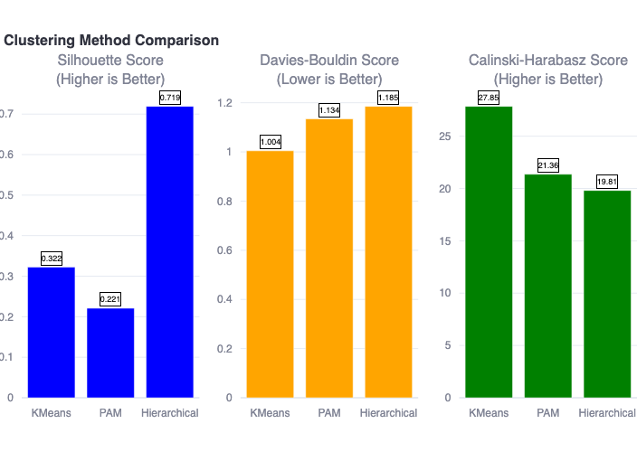
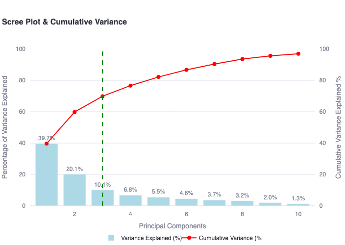
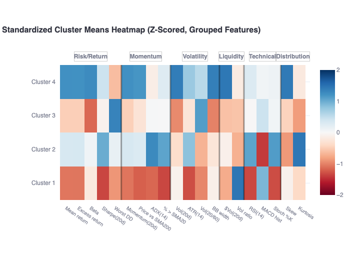

# 📈 Stock Clustering & Risk Intelligence Engine
**Author:** Giang Tran

[](https://python-sql.streamlit.app/)

## 📌 Executive Summary
This project performs an end-to-end stock clustering analysis using unsupervised machine learning. By extracting daily bars from the Polygon.io API, the engine engineers technical indicators and groups 50 major US stocks based on their actual risk-return characteristics, momentum patterns, and volatility, rather than traditional sector labels.

**Business Value:** This tool helps quantitative investors and portfolio managers identify groups of stocks with similar behavioral characteristics. This allows for better portfolio diversification by highlighting hidden correlations and risk clusters that traditional sector-based allocations might miss.

---

## 📊 Key Visualizations & Insights

### 1. Rigorous Model Evaluation
Instead of blindly applying a clustering algorithm, this project rigorously compares KMeans, PAM, and Hierarchical clustering. Using metrics like the Silhouette Score and Davies-Bouldin Index, the engine automatically identifies the most statistically sound groupings.

 

### 2. High-Dimensional Dimensionality Reduction (PCA)
To process over 20 engineered technical indicators (RSI, ATR, Bollinger Bands, etc.), the pipeline utilizes Principal Component Analysis (PCA) to capture ~70% of the variance in 3 components. This allows for clear, 3D visualization of the stock clusters.



### 3. Behavioral "DNA" Heatmaps
The Standardized Cluster Means Heatmap translates the machine learning output into actionable financial insights, allowing users to instantly see which cluster represents "High Volatility/High Return" versus "Steady Momentum."



---

## 🛠️ Technical Architecture & File Map

* **Language & Libraries:** Python 3.10+, Pandas, Scikit-Learn, SciPy, NumPy
* **Visualization:** Streamlit, Plotly, Seaborn
* **Database & API:** SQLite, Polygon.io

**Repository Structure:**
* `fetch_data.py` — Fetches Polygon daily bars and stores them in a local SQLite database.
* `features.py` — Builds the feature set from daily bars (computes technical indicators and aggregated metrics).
* `streamlit.py` — The interactive dashboard for clustering analysis and visualization.
* `symbols.py` — List of the 50 major US stock tickers to fetch.
* `polygon_client.py` — Custom Polygon.io API client wrapper.
* `db.py` — Database schema and operations.
* `requirements.txt` — Python dependencies (optimized for deployment).
* `sql.db` — SQLite database generated post-extraction.

---

## ⚙️ Dataset & Local Setup

**Data Source:** The initial ticker list and base data parameters can be referenced from [Kaggle](https://kaggle.com/datasets/ae2daadecaecac15b060f3f6eff4cef6e866766d2759af7cdb2ebe8cdc791b9d). The live dataset is fetched directly from the Polygon.io API.

### How to Run Locally

**1. Clone the repository and set up the environment:**
```bash
git clone https://github.com/giangphuongtran/python-sql.git
cd python-sql
pip install -r requirements.txt
